# SDLC  (based on resume)

### 1. **Requirement Gathering \& Analysis**

- Collaborated with Business System Analysts (BSAs)
- Stakeholder Engagement and Communication
- JIRA creation and task breakdown
- Technical Design Sessions
- Created detailed architecture diagrams and developer guides (Confluence)

### 2. **System Design**

- Architected cloud-native microservices and event-driven architectures (AWS Lambda, ECS, EKS, API Gateway, EventBridge)
- Designed API contracts for partner integrations
- Defined relational data models for inbound/outbound modules
- Created Disaster Recovery (DR) execution plans
- Designed security architecture (OAuth2.0, OpenID Connect) and certificate management (Venafi TLS, ACM)
- Helm chart design for Kubernetes deployments and Terraform for Infrastructure as Code

### 3. **Development**

- Backend:
    - Python (FastAPI, PySpark, SQLAlchemy)
    - Java (Spring Boot, Hibernate, Spring Security)
    - PL/SQL and complex SQL queries
    - Event-driven programming with AWS services (SQS, SNS, EventBridge)
    - Kafka, RabbitMQ, IBM MQ messaging systems
- Frontend:
    - Angular (v12 to 17), RxJS, NgRx (Redux pattern)
    - Angular Material, SCSS, HTML5
- Containerization:
    - Docker images creation, Kubernetes Helm charts
- Migration and Technology Upgrades:
    - Java version upgrades (7 → 11)
    - Framework upgrades (Struts2 → Spring Boot, Hibernate v3 → v5)
    - Flash to Angular migration
- Performance Optimizations:
    - SQL tuning, caching strategies, batching, eager loading
    - Java profiling and heap optimizations
- Developed tools: Java Swing simulator for SWIFT messages

### 4. **Testing**

- Unit Testing (including code reviews and mentoring)
- API Testing with Postman and SmartBear tools
- Creation of simulation tools for integration testing
- Participated in Agile sprint reviews and retrospectives for quality assurance

### 5. **Deployment**

- CI/CD Pipeline:
    - Harness SaaS, AWS CodePipeline, Bamboo build jobs, XLDeploy
    - Kubernetes multi-tenant EKS cluster provisioning with Terraform, Helm charts
    - Container orchestration on ECS, EKS
- Infrastructure as Code:
    - AWS CDK, CloudFormation, Terraform
- Cloud environment setup:
    - Networking (VPC, ALB, Route 53), Security (IAM, KMS, ACM)
- Automated deployment of microservices and frontend applications

### 6. **Maintenance \& Support**

- Production Support:
    - Incident response, monitoring, and root cause analysis
    - Debugging and replication of issues in lower environments
    - Remediation of vulnerabilities flagged by Wiz and Snyk scans
    - Performance monitoring with CloudWatch, Datadog, xMatters
- Release coordination and version control management (Bitbucket, Bamboo)
- Migration support:
    - Messaging system migration from RabbitMQ → Kafka
    - API platform integrations and cloud migration initiatives

### 7. **Documentation \& Process**

- Technical documentation in Confluence
- Agile/Scrum practices:
    - Daily standups, sprint planning, retrospectives
- Code reviews and mentoring junior/offshore engineers

### summary
- This mind map organizes your work according to typical SDLC phases reflecting your
- full-stack, 
- cloud-native, 
- Agile-driven engineering background 
- strong DevOps experience.

---
## SDLC Principles & Trends - 2025
- This mind map captures the core principles, popular models, key trends, and best practices in Software Development Life Cycle (SDLC) as of 2025.

```mermaid
mindmap
  root((SDLC Principles & Trends - 2025))

    A. Core_Phases 🔰
      Planning 🔸
        Requirements_Gathering
        Feasibility_Study
      Analysis 🔸
        Stakeholder_Interviews
        Requirements_Specification
      Design 🔸
        High-Level_Design
        Low-Level_Design
        UI/UX_Design
      Implementation 🔸
        Coding
        Version_Control
        Code_Reviews
      Testing 🔸
        Unit_Testing
        Integration_Testing
        System_Testing
        Acceptance_Testing
      Deployment 🔸
        Release_Strategies
        Rollback_Plans
      Maintenance 🔸
        Bug_Fixes
        Enhancements
        Monitoring

    B. Popular_Models 🔰
      Waterfall
      V-Model
      Iterative
      Agile
        Scrum
        Kanban
        Lean
        XP
        DevOps
        Scrumban
      Spiral
      Big_Bang

    C. Key_Trends_&_Changes 🔰
      Agile_Dominance 🔸
        Agile_Manifesto
        Continuous_Feedback
      DevOps_Integration 🔸
        CI/CD_Pipelines
        Automation
        Infrastructure_as_Code
      Cloud-Native_Software 🔸
        Microservices
        Serverless
        Containerization
        Cloud_Deployment
      Security_Shift_Left 🔸
        DevSecOps
        Early_Security_Testing
      Compliance_and_Privacy 🔸
        GDPR
        SOC2
        ISO_27001
      AI/ML_Integration 🔸
        Automated_Testing
        Analytics
      Remote_Teams 🔸
        Async_Development
        Collaboration_Tools

    D. Best_Practices 🔰
      Continuous_Learning
      Automation_Testing
      Regular_Code_Reviews
      Shift_Left_Testing
      Monitoring_and_Logging
      Feedback_Loops
      Documentation
      Cross-Functional_Collaboration
      Emphasis_on_User_Experience
      Security_by_Design

    E. Useful_References 🔰
      Agile_Alliance
      DevOps_Handbook
      OWASP
      Cloud_Architectures
      State_of_DevOps_Report

```

