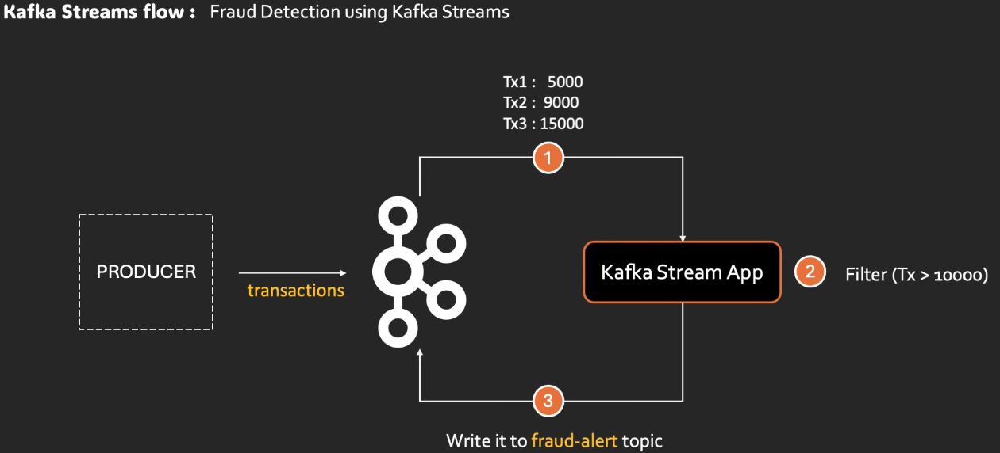

# Kafka Streams
- docs: https://chatgpt.com/c/6951ccd9-ddac-8333-a10e-28ed6ebec776
- POC project/java: https://github.com/lekhrajdinkar/microservice-java/blob/main/README.md#kafka-projects

## A. Intro
- **Scenario**: 
  - bank-txn-topic > event/txn are published here > if txn amt>500 for customer-1 > sent alert + create alert dashboard.
  - note: consumer are stateless, know only current event, not previous event.
- sol-1 (manual, messy)
  - track thing on DB + CRUD
  - load on cache (for performance)
  - custom logic to filter, aggr, map, etc
  - more: handle scaling, thread safety, handel offset, etc
- sol-2 (use kafka Stream processing API) 👈🏻
  - high level (**DSL**) 
    - Declarative style, less code, easy
    - `StreamBuilder`, `KStream`, `KTable`
  - low level (**processor api**)
    - more control
    - but more boilerplate code

---
## B. Simple Consumer vs StreamProcessApp

- Architectural Rule of Thumb 👍🏻👍🏻
    - Microservice logic → Consumer API
    - Data pipeline logic → Kafka Streams
  
| Aspect          | Simple Consumer | Kafka Streams |
| --------------- | --------------- | ------------- |
| Abstraction     | Low-level       | High-level    |
| State           | Manual          | Built-in      |
| Offset handling | Manual          | Automatic     |
| Scaling         | Your problem    | Automatic     |
| Exactly-once    | Hard            | Native        |
| Windowing       | Manual          | Native        |
| Joins           | Manual          | Native        |
| External calls  | Easy            | Risky         |
| Debugging       | Easier          | Harder        |

- **Kafka Consumer API** (`Low-level`)
  - We manage everything:
    - manually poll, deserialize, process, and commit offsets
    - Retry logic, Error handling, Threading & backpressure
    - Stateless by default (state handling is our responsibility)
  - **cons**:
    - Scaling & rebalancing complexity
    - Error-prone offset handling
  - **Best use case**:
    - Event-driven microservices
    - Transactional workflows
    
```java
while (true) 
{
    ConsumerRecords<String, String> records = consumer.poll(Duration.ofMillis(100));
    for (ConsumerRecord<String, String> record : records) {
        process(record.value());
    }
    consumer.commitSync();
}    
```

- **Kafka StreamProcessorApp** (High-level)
  - Built on top of Kafka consumer & producer APIs
  - Built-in : 
    - State stores (Stateless + stateful processing) 
    - Windowing (Maintains separate state per window) 
    - Joins:
      - Stream–Table Join (Enrichment)
      - Stream–Stream Join
    - Aggregations (want summaries, not raw events) 
    - **Repartitioning** (change key for event and distribte events to partition again)
    ```java
        // Key = orderId
        // Value = { userId, amount }
        builder.stream("orders")
            .selectKey((orderId, order) -> order.getUserId()) // 👈🏻 selectKey(...)
            .groupByKey()
            .count();
    ```
  - Changelog Topics (Fault Tolerance)
    ```
    - Every state store has a backing Kafka changelog topic
    - State updates are continuously written to Kafka
    - On crash/restart → state is restored from changelog
    - <application-id>-<store-name>-changelog
    ```   
  - **Horizontally scalable** via Kafka partitions
  - Exactly-once semantics
  - Flow: **Topic → Stream → Transform → Aggregate/Join → Output Topic** 🔸
  - **cons**:
    - Harder debugging 
    - Not ideal for heavy external I/O
  - **Best use cases**:
    - Real-time analytics
    - Event enrichment
    - Stateful transformations
    - Stream joins (KStream-KStream, KTable)


---
## C. System Design Example   
### C.1 Real-Time Fraud Detection App (JT)
- Kafka Streams + Spring Boot + Java21
- https://www.youtube.com/watch?v=U7RZcBtP6Dw&list=PLVz2XdJiJQxz55LcpHFM6QIB-Px40w3Gt&index=4
- 

### C.2 from chatGPT-5.2
```declarative
[ Kafka Topic: orders ]
    |
    v
[ Kafka Streams App (Spring Boot) ]
- filter invalid events
- map (parse JSON)
- group by customerId
- aggregate totalAmount
    |
    v
[ Kafka Topic: customer-order-totals ]
```