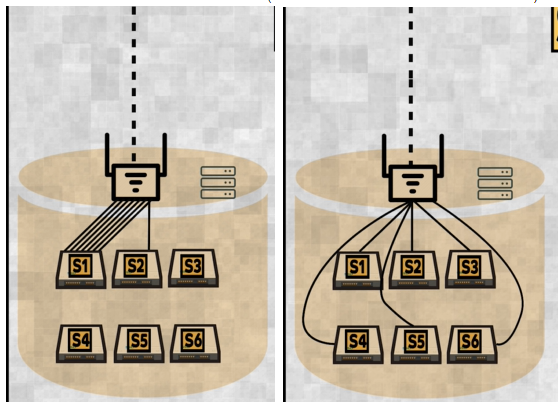

# hashing
## Overview
- https://www.youtube.com/watch?v=pU1uifHXhE4
- Scenario where hashing needed:
  - **Scenario-1**:
    - which algo/logic LB must use, to send traffic from a client to same server ?
    - `(client_key % no of node)`. 
    - preciously, simple hashing `( hash(key) % n )`
    - problem, if no of node is fluctuating (add / delete), then: 
      - need to do **expensive** re-distribute.
      - data moves b/w node.
    - solution - use consistent hashing
    - Note: Always industry grade hash function for `MD5`, `SHA-1`, `Bcrypt`
    - 

  - **Scenario-2**:
    - event/data --> kafka partition-0, 1, or 3 ?
    - event/data --> AWS Kinesis shard-0, 1, or 3 ?

  - **Scenario-3**:
    - data/record/row --> which shard of **Database** ? 
    - shards can be same machine or diff machine
    - 
  
## Consistent hashing
- https://www.youtube.com/watch?v=NLMZzElM8Z4
- It **minimizes** data movement when nodes are added or removed in a distributed system (caches, DB shards, message brokers).
- **key goes to the first node clockwise from its hash** 👈🏻
```
0 -------------------------------- 360
|                                  |
|                                  |
 ----------------------------------

---
 
Node A → hash 50
Node B → hash 150
Node C → hash 300

50(A) -------- 150(B) -------- 300(C) -------- back to 50

---

cleint-1 key-1 --> hash 30 --> next clockwise node = 50(A)
cleint-1 key-2 --> hash 70 --> next clockwise node = 150(B)
cleint-1 key-3 --> hash 160 --> next clockwise node = 300(C)
cleint-1 key-4 --> hash 300 --> next clockwise node = 300(C)

A: k1
B: k2
C: k3, k4

---

Node Added : Node D → hash 100

50(A) ---- 100(D) ---- 150(B) ---- 300(C)

cleint-1 key-1 --> hash 30 --> next clockwise node = 50(A)
cleint-1 key-2 --> hash 70 --> next clockwise node = 100(B)  ❗ (was B)
cleint-1 key-3 --> hash 160 --> next clockwise node = 300(C)
cleint-1 key-4 --> hash 300 --> next clockwise node = 300(C)

A: k1
D: k2
B: -
C: k3, k4

✅ Only keys between A → D moved
❌ Not a full reshuffle

```

