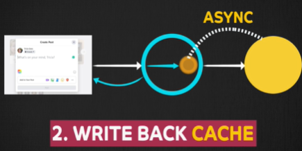

# Caching
## Overview
- storing data in a location different from the original data source
- high-speed data storage layer
- provide faster data access

## Where can Caching be Placed
**Client Level**
- The client can store data to avoid going to the server.

**Server Level** 
- The server can cache data after calling the database once.
  - cache for each node
  - common cache for all node, dedicated system
  -  

**Between Server and Database** 
- A dedicated cache layer can exist between the server and the database.

**Hardware Level** 
- CPU caches are built into hardware for faster data retrieval from memory. 
- This is generally out of scope for software engineers

---
##  When Caching is Helpful
**Minimizing Network Calls** 
- In a client-server-database architecture, 
- network calls between these separate machines are common.
- Caching the results of network operations, could
- speeds up processes by avoiding frequent calls to the database.

**Speeding Up Computationally Expensive Operations**

**Preventing Database Overload (Data Hotspots)**
- When many clients (e.g., millions of users) try to access the same popular data 
- reducing read requests on Database

---
## Caching Systems for Writes 

**Write-Through Cache:** 
- When data is edited, the system writes the data to both :
  - the cache 
  - the main database, **at the same time**.
- Benefit: Cache and database are always in **sync**.
- Downside: **Doesn't minimize network calls**, as the database is always hit.

**Write-Back Cache:** 
- When data is edited, the system  updates 
  - the cache **immediately** + sends a response back to the client (non-blocking) 
  - The database is updated **asynchronously** at a later time.
    - (e.g., randomly, scheduled every 30 seconds or 5 minutes).
- Benefit: Faster response to the client, because the database isn't immediately touched.
- Downside: The cache and database can **temporarily be out of sync**.

