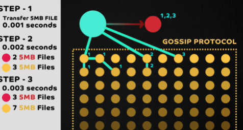
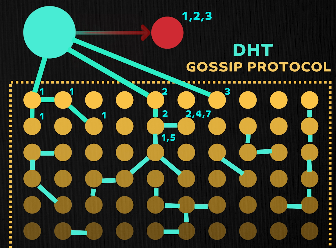

# client-server architecture
- dns concept
- http 80 | https  8443
- `nslookup` command
- ...

---
## ✔️Polling
- https://www.youtube.com/watch?v=b4qyOpGg748
- client repeatedly requests data from a server at set intervals.
- eg:
  - Temperature Monitoring
  - not ideal for real-time applications like chat
- **reducing** the polling interval
  -  it significantly increases the **load on the server**, 
  - as clients send many **unnecessary requests**.
  
> ℹ️ suitable for data that doesn't **need to be updated very frequently**

---
## ✔️Streaming
- https://www.youtube.com/watch?v=b4qyOpGg748
- the client opening a **long-lived connection** with the server, 
- typically through a **socket**, 
- allowing the server to **push** information **without a client request**

> ℹ️ **instantaneous experiences**
> - the server proactively sends or "pushes" data to the client, 
> - rather than passively waiting for requests.
> - Enables a **continuous flow of data**

---
## ✔️Pub-Sub 
Async comm between client-server

([🔗kakfa](../../PE_03_message-broker/kakfa) is popular tool) 👈🏻

> **At Least Once Delivery**
>   - subscriber receives a message but loses connection before acknowledging it.
>   - leading the topic to re-send the message when the connection is re-established
>   - **idempotent operation** yields the same outcome regardless of how many times it's performed
> 
> **Message Ordering** : "first-in, first-out" (FIFO)
> 
> **Message Replay**, due to their underlying persistent storage

**Components(4)**
- Publishers:
- Topics: 
  - Act as channels or intermediaries with specific information.
  - Persistent Storage via Topic
- Subscribers: 
  - Clients that listen for data from topics.
  - can subscribe to multiple topics based on their needs.
  - Unlike streaming, subscribers listen to the topic, not directly to the publishers
- Messages: Represent data or event

**More**
- **separation of concern**. separate topic for each business domain.
- **Content based filter** subscriber to filter data

---
## ✔️Peer 2 Peer
https://www.youtube.com/watch?v=2v6KqRB7adg

 

**Example of transferring large video files to thousands of machines**
1. single server approach (10 videos, 5GB each) - `15 min`
2. sharding, 5 server (2 videos each, 5GB each) - `15/5 = 3 min`
3. P2P solution - `1 sec`
   -  large file is split into small chunks and distributed among peers
   - These peers then communicate with each other in **parallel** to assemble the complete file
   - **peer discovery** 
   - **peer selection strategies** within a P2P network
   - Centralized database (tracker), Gossip protocol, distributed hash table (DHT)

