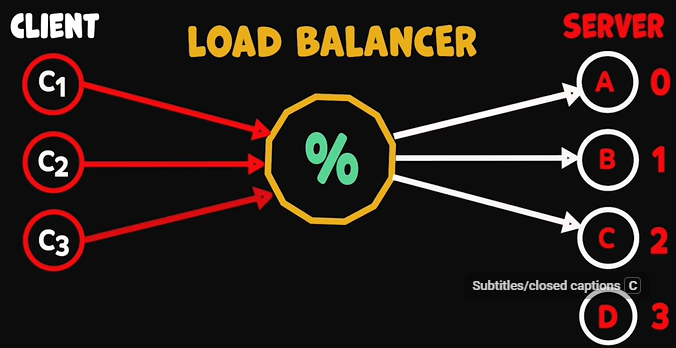
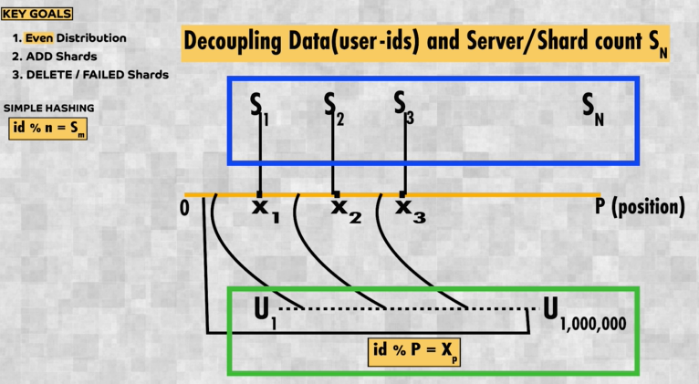

# Hashing
## Problem statement
> Distribute **uniformly** among fluctuating node count (add / delete)
> - need to do **expensive** re-distribute.
> - data moves b/w node.

**Distribution Scenario**
- **Scenario-1**: load is distributed for serving client 👈🏻
  - 

- **Scenario-2**: event is distributed for processing 👈🏻
  - event/data --> kafka partition-0, 1, or 3 ?
  - event/data --> AWS Kinesis shard-0, 1, or 3 ?

- **Scenario-3**: data is distributed for storage 👈🏻
  - data/record/row --> which shard of **Database** ? 
  - shards can be same machine or diff machine
  - 

### Solution-1: Simple hashing 🔺
https://www.youtube.com/watch?v=pU1uifHXhE4
- node_count = 10
- hash(client_key) = client_id (1 to 10)
- client_id % node_count
- node_count changes, 
  - Need to re-distribute.
  - cant eliminate
  - but how to minimize re-distribute
  - check below ⤵️

### Solution-2: Consistent hashing
- overview : https://www.youtube.com/watch?v=NLMZzElM8Z4
- It **minimizes** data movement when nodes are added or removed in a distributed system (caches, DB shards, message brokers, pods).
- **key goes to the first node clockwise from its hash** 👈🏻

**Understand by example**

```
0 -------------------------------- 360
|                                  |
|                                  |
 ----------------------------------

---
 
Node A → hash 50
Node B → hash 150
Node C → hash 300
** industry grade hash function for `MD5`, `SHA-1`, `Bcrypt`

50(A) -------- 150(B) -------- 300(C) -------- back to 50

---

cleint-1 key-1 --> hash 30 --> next clockwise node = 50(A)
cleint-1 key-2 --> hash 70 --> next clockwise node = 150(B)
cleint-1 key-3 --> hash 160 --> next clockwise node = 300(C)
cleint-1 key-4 --> hash 300 --> next clockwise node = 300(C)

A: k1
B: k2
C: k3, k4

---

Node Added : Node D → hash 100

50(A) ---- 100(D) ---- 150(B) ---- 300(C)

cleint-1 key-1 --> hash 30 --> next clockwise node = 50(A)
cleint-1 key-2 --> hash 70 --> next clockwise node = 100(B)  ❗ (was B)
cleint-1 key-3 --> hash 160 --> next clockwise node = 300(C)
cleint-1 key-4 --> hash 300 --> next clockwise node = 300(C)

A: k1
D: k2
B: -
C: k3, k4

✅ Only keys between A → D moved
❌ Not a full reshuffle

```

