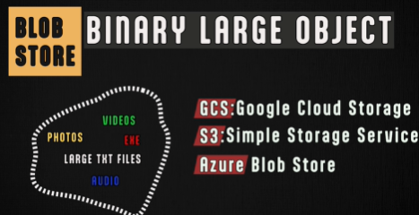
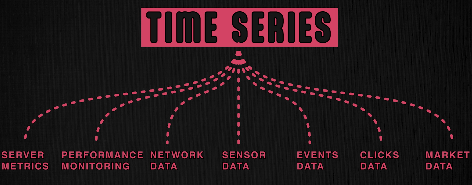
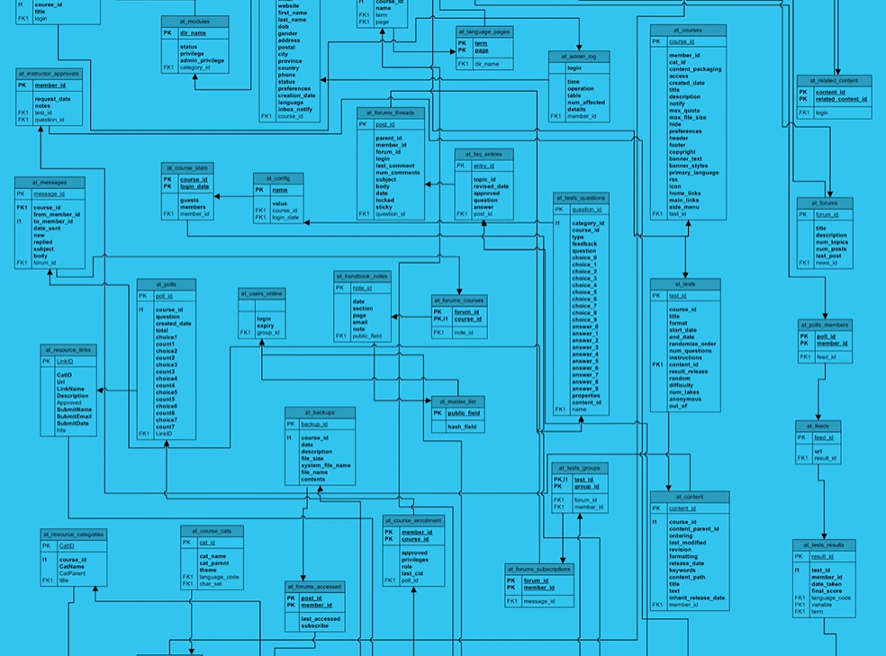

# NoSQL DB
> - no relation, no schema
> - don't have a querying language
    >   - only provide simple operations like get, put, and delete.

## key-value Store
- eg: `dynamoDB (disk, eventual-consitency)`, `redix(inMemory)`, `Cassandra`, `apache ZooKeeper`
- one of the popular NoSQL DB
- Stores data as a collection of key-value pairs, similar to a dictionary or map data structure.
    - key -> String. hashed to memoryLoc
    - value -> String, arrays, integer
- **flexible** due to their lack of imposed structure
- **Direct key-based access** leads to extremely fast **performance**. O(1)
    - offering low latency and high throughput.👈🏻
- beneficial when:
    - data management is less critical than performance
    - data model is not hierarchical.
- **use case:**
    - cache
    - suitable for dynamic configurations
---
## Specialized Store
### BLOB Store

- Stores unstructured data like photos, audio, video files, and large text files.
- **optimized fo**r 
  - massive amounts of unstructured data, 
  - highly scalable, 
  - reliable, and available
- Behaves like key-value stores for data-access.
- Examples: GCS,S3, Azure Blob Storage

### Time Series
**use cases**

**optimized for:**
  - for storing time-stamped data 
  - or events that occur at specific intervals (e.g., every millisecond).

Example: InfluxDB and Prometheus.

### Graph DB
rdbms with lots of relation/s

- Built on a **graph data model** 
  - where relationships between data points are of prime importance.
  - datasets with many billions of interconnections
- **PGQL**
  - Simplifies complex queries 
  - and provides deeper insights into relationships with less effort
  - Excels at finding **shortest paths** between nodes
- Use Cases Social networks (e.g., Facebook)
- Example: Neo4j