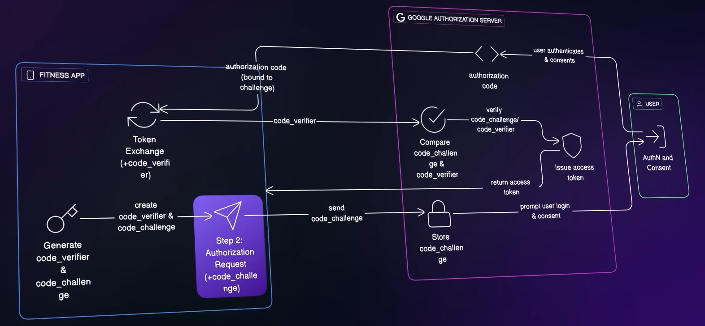
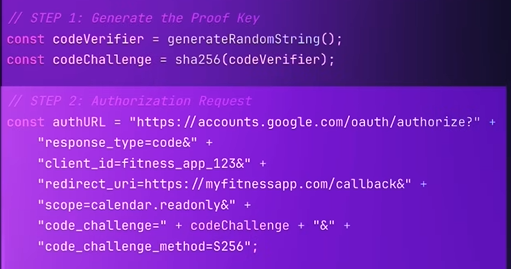
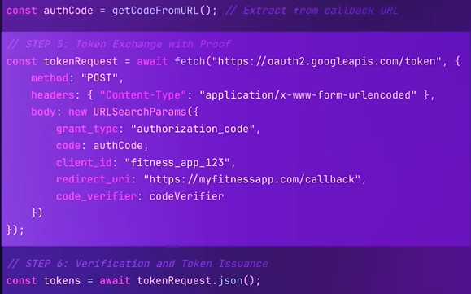

# OAuth2.1
## Overview
- OAuth2.0 - delegated **authorization** protocol
- OIDC : on top of OAuth with addition oidc scope to return identity token for **Authentication**
- safe way to connect to app without. sharing password.

- ✔️**component**
  - ➖auth server (token issuer) +  Idp (for authentication)
    - Could be same or separate entity.
    - google, okta, facebook, etc play both role.
  - ➖resource server (token verifier)
  - ➖resource owner (user / person)
  - ➖client 
  
- ✔️**generic flow**:
  - Step-1 : client --> request access token --> from Auth server
    - how to safely get it ?
  - Step-2 : client --> access token (**short live, limited access**) --> to resource server
    - set as Authorization header (type of token - bearer)
    - RS Validates access_token signature:
      - way-1 configure a public key (jwt), 
      - way-2 using Okta's JWKS (JSON Web Key Set) endpoint
    - RS Verifies claims like exp, aud, scope, etc.

---
## Token
- **type**
    - access token (permissions)
    - identity token
    - refresh token
- format - **JWT**
    - could use other format as well.
    - but OAuth with JWT token, is the best security combination.
    - JWT itself powerful protocol. 👈🏻
    - check more: [jwt](03_protocol_jwt.md)

---  
## Grant type (OAuth flows)
### 1. client credential flow
- **scenario** : machine to machine comm 
- Flow:
  - app1 (api) has client_id /  client_secret 
  - app1 (api) exchange them for access token with auth server directly
  - app1 (api) calls with token to app-2 (api, act as resource server)
- picture: https://mike-outcomesec.medium.com/oauth-2-0-client-credentials-flow-to-snowflake-external-oauth-bc3b1f712754
- no refresh token.

### 2. authorization flow
- **scenario**: traditional webApp - Django / JSP
- client app deployed on **aws**. 
    - app1.com (JSP application - ui + backend)
    - `client_id, client_secret, scope, redirect_url`
- Flow (https)
    - resource owner (human) opens browsers and hits app1.com (client)
    - client (app1.com) makes **authz code request**, first.
    - first goes to idp for authentication. (maybe 👉redirects to login prompt)
    - post authn, authz request (scope, cleint_id, etc) accepted by auth server
    - 👉redirects to page asking for permission (browser, pop up)
    - resource owner, clicks allow/deny
    - **auth-code** 👉redirected to client app1(browser) from authz server 
    - client app1 (browser) --> send **auth-code** via 👉redirect_url `app1.com/callback` (aws)
    - client app1 (aws) --> exchange code for access-token + refresh token
- more: https://www.youtube.com/watch?v=ZDuRmhLSLOY (7:50)
- picture: https://auth0.com/docs/get-started/authentication-and-authorization-flow/authorization-code-flow

#### 2.1 authorization flow + PKCE - SPA
- OAuth2.1 make PKCE mandatory
- use case: SPA, Mobile App, Desktop App
- https://www.youtube.com/watch?v=5FrA0UzV1Aw
  - randon String - cc `code challenge`
  - hash RSA (cc) = cv `code verifier`
  - AuthZ code request (attach - cc)
  - get Authz code
  - exchange code with token request (pass cv)
  - verifies cv and return token.







### 3. implicit flow (old) - SPA ❌
- Simplified version of Authorization code flow.
- web app (js/ng) request token directly.
- Flow (https)
    - resource owner (human) opens browsers and hits app1.com (client)
    - client (app1.com) makes **authz token request**, first.
    - first goes to idp for authentication. (maybe 👉redirects to login prompt)
    - post authn, authz request (scope, cleint_id, etc) accepted by auth server
    - 👉redirects to page asking for permission (browser, pop up)
    - resource owner, clicks allow/deny
    - **access-token** 👉redirected (`app1.com/callback`) to client app1(browser) from authz server
  
---

## Scenario
- okta as both
```
When Okta issues tokens:

Okta is the "Issue"r"

    It creates the JWT (ID token and access token).
    The iss claim in the token will look like:
    "iss": "https://<your-okta-domain>.okta.com/oauth2/default"


Okta is also the "Verifier" (indirectly, via your app)

    Your backend application verifies the JWT token against Okta’s public keys (JWKS endpoint).
    This is done by checking the signature using Okta’s public key.
    So your app is the one doing verification, but the trust anchor is still Okta.
```

| Role              | Description                                                                                                       |
| ----------------- | ----------------------------------------------------------------------------------------------------------------- |
| **Issuer**        | Okta (signs the JWT with its private key)                                                                         |
| **Verifier**      | Your app/API (verifies JWT using Okta's public key)                                                               |
| **JWKS endpoint** | URL where your app fetches Okta’s public keys, e.g.: `https://<your-okta-domain>.okta.com/oauth2/default/v1/keys` |


