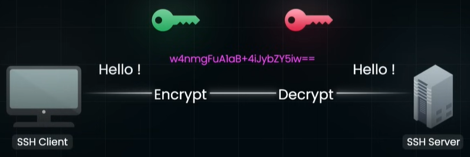
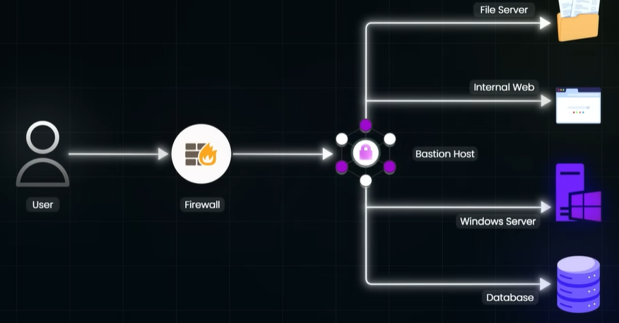
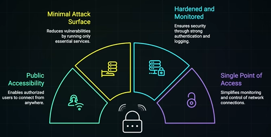
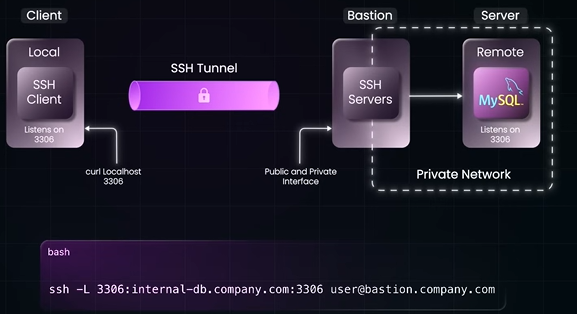
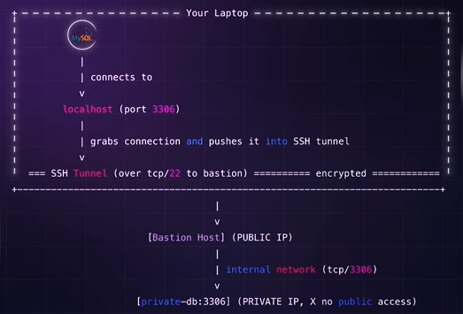
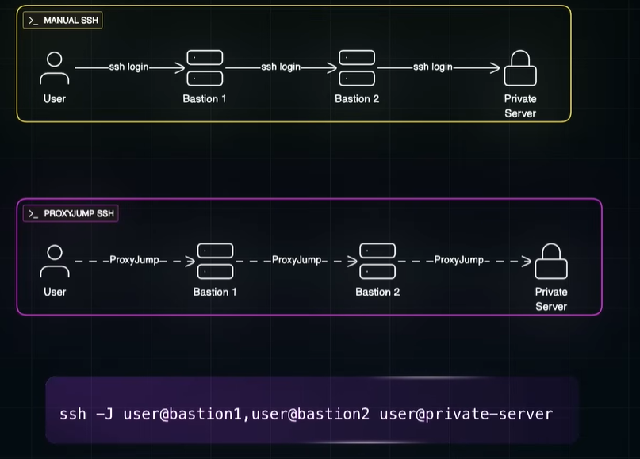

# SSH
## Overview
- https://www.youtube.com/watch?v=s-vhqtyUF4I&ab_channel=ByteMonk
- https://www.perplexity.ai/search/ssh-https-www-youtube-com-watc-ScmhmYP.RDe3ZxozAqsjMg 
- older: **telnet**, sends plain text. replaced by SSH
- analogy : http vs https(tls)
- SSH by design securely (Encrypted) connect to and control remote machines:
  - Manage Server
  - Transfer file
  - Run commands remotely
  - etc

### Step-1 : SSL handshake
- purpose: form secure **SSH tunnel** for encrypted communication
- general flow:
  - > Asymmetric cryptography for initial handShake,
    > then symmetric for actual data transfer
  - server creates **Asymmetric** Key  (RSA)
  - share public key with client
  - use it to create **symmetric** `session key`, since fast.
    - ephemeral, random, used and discarded after session ended.
  - use it for rest of encrypted data comm.
- eg:
  - aws > ec2 > create key-pair (type=rsa, file-format=.pem)
  - **github push** also uses ssh-channel
  

### Step-2 : Authentication
- key based authn

---
## bastion host

- https://www.youtube.com/watch?v=da-qb91mD6g
- Scenario-1:
  - private server/s running in VPN with strict firewall (Database, etc)
  - has no public IP
  - engineers need to connect to them from outside VPC, for patching ?
  - way-1: get access to whole VPN (violate the least privilege)
  - way-2: least privilege with **bastion server** 
    - > Engineers only sees what to suppose to see.
  
- overview:
  - gateway for VPN. has public IP to listen internet trafic and forwards to private machine.
  - take SSL traffic/request
  - forward traffic to port on internal private server.
  - this **port forwarding** 👈🏻
  - 
  - 
  - Notice -L option for port forwarding

- can have **bastion-1 > bastion-2  > ... >  private machine**
  
- **Jump -j option** ❌
  - chains them in single 
  - 

- Check AWS modern way, they dont use bastion to implement ZTS 👈🏻👈🏻