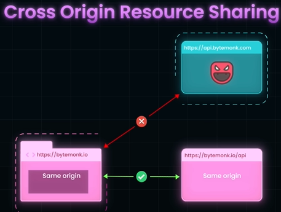
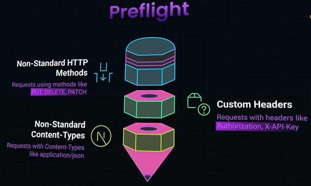

# CORS ( Cross Origin Resource Sharing)
## Overview
- https://www.youtube.com/watch?v=E6jgEtj-UjI
- A strict browser rule that prevents web pages from making API requests to different origins
- same protocol, same domain and same port.
- local development
  - use proxy
  - CORS everywhere extension.
- **For simple http request**
  - no pre-flight request
  - request sent and response is  not blocked if server response includes CORS header
```
A request is simple if all of these are true:
1️⃣ Method:
GET,POST,HEAD

2️⃣ Headers:
No credentials-triggering headers eg: Authorization
Accept
Accept-Language
Content-Language
Content-Type :
    application/x-www-form-urlencoded
    multipart/form-data
    text/plain
```



## Preflight request.
- for below 3 cases, it goes:   


**Example**

```
Scenario:
Frontend: https://app.example.com
Backend API: https://api.example.com

Actual request will be:
    Method: PUT
    Headers: Authorization, Content-Type: application/json

---
1️⃣ Preflight request (sent by the browser)

OPTIONS /users/123 HTTP/1.1
Host: api.example.com
Origin: https://app.example.com
Access-Control-Request-Method: PUT
Access-Control-Request-Headers: authorization, content-type

---
2️⃣ Server preflight response (what the server must return)

HTTP/1.1 204 No Content
Access-Control-Allow-Origin: https://app.example.com
Access-Control-Allow-Methods: GET, POST, PUT, DELETE
Access-Control-Allow-Headers: Authorization, Content-Type
Access-Control-Allow-Credentials: true
Access-Control-Max-Age: 600

If any preflight rule fails, this request is never sent. 👈🏻

---
3️⃣ Actual request (sent only if preflight succeeds)

PUT /users/123 HTTP/1.1
Host: api.example.com
Origin: https://app.example.com
Authorization: Bearer eyJhbGciOi...
Content-Type: application/json

{
  "name": "Alice"
}

```