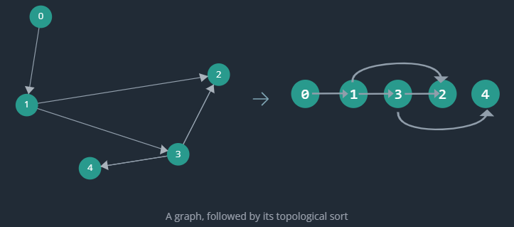

# Graph : Sort
## 1. Topological Sort
- takes a directed acyclic graph **(DAG)** and turns it into a **linear ordering of nodes**
- such that the directed edges only point forward, from left-to-right.
- A given graph may have **more than one valid topological sorts**.



###  tab:1 indegree
- number of incoming edges to that node

```python
#========================
# A. build from edges
#========================

edges = [(0, 1), (1, 2), (1, 3), (3, 2), (3, 4)] # vertex u->v
n = 5
def indegree(n, edges):
    indegree = [0] * n
    for u, v in edges:
        indegree[v] += 1
    return indegree
# output: [0, 1, 2, 1, 1]
```

```python
#========================
# B. build from adjList
#========================

n = 5
adj_list = {
    0: [1],
    1: [2, 3],
    2: [],
    3: [2, 4],
    4: []
}

def indegree2(n,adj_list):
    indegree = [0] * n
    for u in adj_list:
        # increment the indegree of each neighbor of u
        for v in adj_list[u]:
            indegree[v] += 1
```

### tab:2 Kahn's Algorithm ⭐
> Kahn's algorithm is a form of **BFS** in which nodes with lower indegrees are placed on the queue before nodes with higher indegrees.

**Algo:**
- Calculate the indegree of each node.
- Add all nodes with an indegree of 0 to a queue.
- While the queue is not empty:
  - Dequeue the first node from the queue and add it to the topological order (result arr)
  - For each neighbor of the node, decrement its indegree by 1.
  - If the neighbor's indegree is now 0, add it to the queue.
  - Repeat
- Return the topological order.

[01_kahn-algo.excalidraw](../draw/03/10_graph_more/01_kahn-algo.excalidraw)

### tab:3  Kahn's Algorithm (solution.py)
@[code:section::topological_sort](../../../../src/leetcode/hellointerview/graph/Exercise-1.py)

### tab:4  adjList
@[code:section::util-1](../../../../src/leetcode/hellointerview/graph/Exercise-1.py)