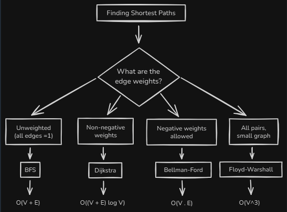
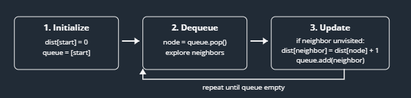
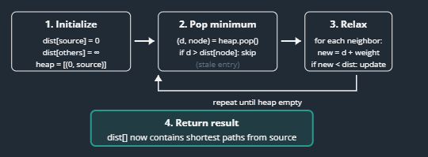

# Graph: Shortest Path Algorithms
## reference
- https://www.hellointerview.com/learn/code/graphs/shortest-path-algorithms

## Overview
shortest path from one source node to all other nodes



---
## 1. BFS
> [BFS-on-graph.md](../03_Problems/03_09_BFS/02_01_BFS-on-graph.md)

### When to Use
- Grid navigation (moving up/down/left/right)
- Unweighted graph traversal | can assume, weight is 1 for all edges
- Finding **minimum** number of steps/moves

### visual 
[03_bfs-shortest-path.excalidraw](../draw/03/10_graph_more/03_bfs-shortest-path.excalidraw)



### Algo

```python
graph_AdjList = {
    0: [1, 2],
    1: [3],
    2: [1, 3],
    3: [4],
    4: []
}
start = 0

#====================
# O(V + E)
from collections import deque
def bfs(graph: dict, source: int):
    distances = {node: float('inf') for node in graph}
    distances[source] = 0
    queue = deque([source])

    while queue:
        node = queue.popleft()
        for neighbor in graph[node]:
            if distances[neighbor] == float('inf'):
                distances[neighbor] = distances[node] + 1
                queue.append(neighbor)
    return distances
```

**Complexity**
- `O(V + E)` | space
- `O(V + E)` | time

---
## 2. Dijkstra's Algorithm
### When to Use
- Weighted graphs with **non-negative** edges
- Finding the **shortest path** from one source to all nodes
- Problems involving **"minimum cost" or "minimum time"**

### visual
[02_Dijkstra.excalidraw](../draw/03/10_graph_more/02_Dijkstra.excalidraw)



---
### Algo


```python
# AdjList | key:int --> value:list[tuple(node, weight)]
graph_AdjList = {
    0: [(1, 4), (2, 1)],
    1: [(3, 1)],
    2: [(1, 2), (3, 5)],
    3: [(4, 3)],
    4: []
}

# ========================
import heapq
def dijkstra(graph:dict, source:int):
    distances = {node: float('inf') for node in graph} # result
    distances[source] = 0 # [ 0, inf, inf, inf, inf]
    heap = [(0, source)] 

    while heap:
        dist2Node, node = heapq.heappop(heap) # heap will pop next smallest
        if dist2Node > distances[node]: continue # ignore long path
        
        # explore short path further
        for neighbor, weight in graph[node]:
            dist2neighbor = dist2Node + weight
            if dist2neighbor < distances[neighbor]:
                distances[neighbor] = dist2neighbor # update result
                heapq.heappush(heap,(dist2neighbor, neighbor)) # so that can further explore it.

    return distances
```

**Complexity:**
- `O((V + E) log V)` | time
  - V = number of nodes
  - E = number of edges
  - heap push/pop = `O(log V)`
- `O(V + E)` | space


