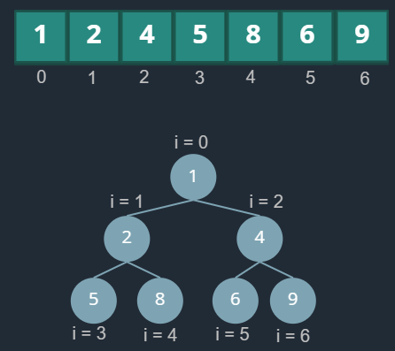

# DSA: heap
## Reference
- https://www.hellointerview.com/learn/code/heap/overview

## Overview
- Heaps are **complete binary trees**
- the smallest value in the **array** is always in the first index of the array.
  - If we **remove** the smallest value from the heap, the elements of the array efficiently re-arrange so that the next smallest value takes its place
- **height** of a heap is `O(log n)`, where `n` is the number of elements in the heap
- Python provides a built-in `heapq`



| Relationship    | Formula        |
| --------------- | -------------- |
| **Left Child**  | `2 * i + 1`    |
| **Right Child** | `2 * i + 2`    |
| **Parent**      | `(i - 1) // 2` |

## operation

| **Operation** | **Time Complexity** | **Notes**                                                 |
| ------------- | ------------------- | --------------------------------------------------------- |
| `pop`         | **O(log n)**        | Remove root → move last element to root → **bubble down** |
| `push`        | **O(log n)**        | Add element at end → **bubble up**                        |
| `peek`        | **O(1)**            | Access the root element                                   |
| `heapify`     | **O(n)**            | Build a heap from an array                                |


**push(element):** 
- Add a new element to the heap. 
- bubble up : 
  - new element is less than its parent, swap the two elements,
  - Repeat this process until the new element is greater than its parent,
  - or until it reaches the root of the heap.
- time taken: `O(log n)`

**pop():** 
- Remove the **root** element from the heap.
- When the pop operation is complete, the **new root** of the heap is the **new minimum** value in the heap,
-  time taken: `O(log n)`
- `peek()`: Get the root element without removing it. `O(1)`

**heapify([])**: 
- Convert an array into a heap in `O(n)` time.
- creates a min-heap
- For max-heap, we can negate the values in the list and then convert it into a heap
-  also be used to store **tuples** in the heap.  the heap is ordered based on the **first element** of the tuple

## heapQ : py lib
```python
import heapq

arr = [3, 1, 4, 1, 5, 9, 2]
# negated_arr = [-x for x in arr]
# arr_of_tuple = [(3, 1), (1, 5), (4, 2), (1, 9), (5, 3), (9, 4), (2, 6)]

# convert array into a heap in-place. O(n)
heapq.heapify(arr)
# push 0 to the heap. O(log n)
heapq.heappush(arr, 0)
# peek the min element = 0. O(1)
arr[0]
# pop and return the min element = 0. O(log n)
min_element = heapq.heappop(arr)
# peek the new min element = 1. O(1)
arr[0]
```
---
## Patterns ⭐
**When to use**
- "Top K" problems
- k smallest
- k largest
- closet
- most frequent


