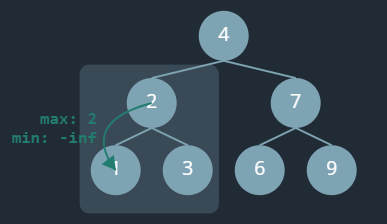
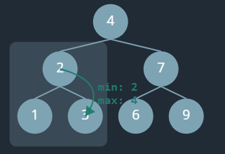

# 2. DFS: Exercise (Binary Tree, 10 problems)

## 00. Find the maximum value in a binary tree ✔️
- `max(left, node.val, right )`

@[code:section::DFS-return-problem-2](../../../../src/leetcode/hellointerview/DFS/exercise-0.py)

---
## 00. Sum of Nodes ✔️
- `sum(node) = sum(node.left) + sum(node.right) + node.val`
-  bubbles up, from the leaf nodes up to the parent nodes until we reach the root node
-  each recursive call should return the **sum of its subtree**

@[code:section::DFS-return-problem-1](../../../../src/leetcode/hellointerview/DFS/exercise-0.py)

---
## 563 | E. Binary Tree Tilt ✔️
- take sum of left amd right subtree and parallely calculate tilt.
- https://leetcode.com/problems/binary-tree-tilt/description/
- https://www.hellointerview.com/learn/code/depth-first-search/calculate-tilt | Skip

@[code:section::section-563](../../../../src/leetcode/hellointerview/DFS/exercise-1.py)

---
## 104 | E. Maximum Depth of Binary Tree ✔️
- https://leetcode.com/problems/maximum-depth-of-binary-tree/description/
- https://www.hellointerview.com/learn/code/depth-first-search/maximum-depth-of-binary-tree | skip

@[code:section::section-104](../../../../src/leetcode/hellointerview/DFS/exercise-1.py)

---
## 112 | E. Path Sum ✔️
- https://leetcode.com/problems/path-sum/description/
- https://www.hellointerview.com/learn/code/depth-first-search/path-sum | skip

@[code:section::section-112,section-112-hi](../../../../src/leetcode/hellointerview/DFS/exercise-1.py)

---
## 113 | M. Path Sum II ✔️
- https://leetcode.com/problems/path-sum-ii/description/
- https://www.hellointerview.com/learn/code/depth-first-search/path-sum-2

### tab:1 Solution
@[code:section::section-113](../../../../src/leetcode/hellointerview/DFS/exercise-1.py)

### tab:2 Console output
```output
│           ┌── 1
│       ┌── 4
│       │   └── 5
│   ┌── 8
│   │   └── 13
└── 5
    └── 4
        │   ┌── 2
        └── 11
            └── 7
node : 5 , new partialSum : 5, arr: [5]
node : 4 , new partialSum : 9, arr: [5, 4]
node : 11 , new partialSum : 20, arr: [5, 4, 11]
node : 7 , new partialSum : 27, arr: [5, 4, 11, 7] | Leaf
node : 2 , new partialSum : 22, arr: [5, 4, 11, 2] | Leaf
	matching root2leaf_pathSum: 22 with targetSum: 22
	result: [[5, 4, 11, 2]]
	
node : 8 , new partialSum : 13, arr: [5, 8]
node : 13 , new partialSum : 26, arr: [5, 8, 13] | Leaf
node : 4 , new partialSum : 17, arr: [5, 8, 4]
node : 5 , new partialSum : 22, arr: [5, 8, 4, 5] | Leaf
	matching root2leaf_pathSum: 22 with targetSum: 22
	result: [[5, 4, 11, 2], [5, 8, 4, 5]]
node : 1 , new partialSum : 18, arr: [5, 8, 4, 1] | Leaf
```
---
## 1448 | M. Count Good Nodes in Binary Tree ⭐⭐
> Given a binary tree root, a node X in the tree is named good if in the path from root to X there are no nodes with a value greater than X.
- https://leetcode.com/problems/count-good-nodes-in-binary-tree/description/
- https://www.hellointerview.com/learn/code/depth-first-search/global-variables

@[code:section::section-1448](../../../../src/leetcode/hellointerview/DFS/exercise-1.py)

---
## 98 | M. Validate Binary Search Tree
> - Every node in the left subtree of the root node, must have a value less than the value of the root node.
> - Every node in the right subtree of the root node, must have a value greater than the value of the root node.
- https://www.hellointerview.com/learn/code/depth-first-search/validate-binary-search-tree
- https://leetcode.com/problems/validate-binary-search-tree/description/




```visualize
             5
          (-∞, ∞)
           /     \
          4       6
      (-∞,5)    (5,∞)
```

@[code:section::section-98](../../../../src/leetcode/hellointerview/DFS/exercise-1.py)

---
## 543 | E. Diameter of Binary Tree ⭐
> diameter of a binary tree is the length of the longest path
- https://leetcode.com/problems/diameter-of-binary-tree/description/
- https://www.hellointerview.com/learn/code/depth-first-search/diameter-of-a-binary-tree

@[code:section::section-543](../../../../src/leetcode/hellointerview/DFS/exercise-1.py)

---
## 687. Longest Univalue Path 🔺
> dfs(node) returns the longest downward path starting from node where all values are equal to node.val.
- similar to Diameter of Binary Tree
- Wrong Answer  `36 / 71` testcases passed 🔺
- https://leetcode.com/problems/longest-univalue-path/description/
- https://www.hellointerview.com/learn/code/depth-first-search/longest-univalue-path

@[code:section::section-687](../../../../src/leetcode/hellointerview/DFS/exercise-1.py)
