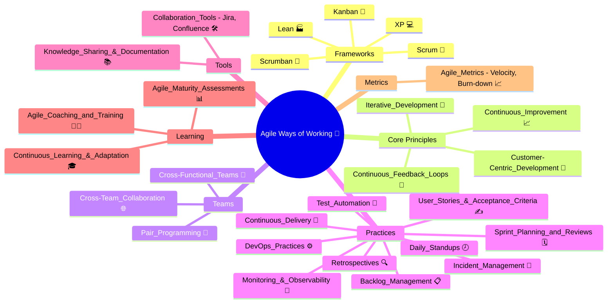

## Introduction
- **Agile frameworks** like Scrum and Kanban help structure work to deliver value frequently and adapt to change.
- **Cross-functional teams** enable faster, higher quality releases by reducing handoffs and silos.
- **Feedback loops** (demos, reviews, testing) and **continuous improvement** (retrospectives) ensure learning and iterative value creation.
- **Collaboration tools** (Jira, Confluence) facilitate transparency, tracking, documentation, and asynchronous work—essential for modern distributed teams.
- **DevOps and automation** (CI/CD, test automation) connect development to operations for reliable, rapid releases.
- **Metrics** (velocity, burn-down) keep delivery data-driven, while **coaching/training** and **maturity assessments** support growth.
- Agile's **customer-centric approach** means everything is geared to meet real-world needs and maximize business value—critical for financial sector organizations like CCGG.

---
## Agile Mind Map

---
## Agile Principles and Practices

### Agile Frameworks \& Approaches

- Scrum 🏉
- Kanban 📝
- Lean / XP / Scrumban 🏭💻🔄

### Team Structure \& Collaboration

- Cross-Functional Teams 🤝
- Cross-Team Collaboration 🌐
- Pair Programming 👥

### Core Agile Practices

- Iterative Development 🔁
- Continuous Feedback Loops 🔄
- Continuous Improvement 📈
- Customer-Centric Development 👤

### Agile Ceremonies \& Events

- Daily Stand-ups 🕗
- Sprint Planning \& Reviews 🗓️
- Retrospectives 🔍

### Planning \& Prioritization

- Backlog Management 📋
- User Stories \& Acceptance Criteria ✍️

### Tools \& Automation

- Collaboration Tools (Jira, Confluence) 🛠️
- Test Automation 🤖
- Continuous Delivery 🚚
- DevOps Practices ⚙️

### Monitoring \& Incident Response

- Monitoring \& Observability 🧐
- Incident Management 🚨

### Learning, Metrics \& Growth

- Continuous Learning \& Adaptation 🎓
- Knowledge Sharing \& Documentation 📚
- Feedback Loops 🔄
- Agile Metrics (Velocity, Burn-down, etc.) 📈
- Agile Coaching \& Training 🧑🏫
- Agile Transformation 🔄
- Agile Maturity Assessments 📊

---
## Glossary of Agile Concepts

| Concept | Emoji | Explanation |
| :-- | :-- | :-- |
| Scrum | 🏉 | Framework emphasizing sprints, roles (SM, PO, team), ceremonies, incremental delivery. |
| Kanban | 📝 | Visual workflow board managing WIP limits, continuous flow, flexible priorities. |
| Lean / XP / Scrumban | 🏭💻🔄 | Other Agile frameworks blending process efficiency, quality, and adaptability. |
| Cross-Functional Teams | 🤝 | Teams with all skills needed to deliver value without external dependencies. |
| Continuous Feedback Loops | 🔄 | Regular reviews, demo days, and feedback sessions to improve product and process. |
| Iterative Development | 🔁 | Deliver value in small, frequent increments instead of large releases. |
| Continuous Improvement | 📈 | Kaizen: small, ongoing changes based on team reflection and data. |
| Collaboration Tools (Jira, Confluence) | 🛠️ | Platforms for tracking work, documenting, and collaborating asynchronously. |
| Retrospectives | 🔍 | Ceremonies at end of sprints/iterations to reflect, learn, and improve. |
| User Stories \& Acceptance Criteria | ✍️ | Clear, concise expressions of end-user requirements with “done” criteria. |
| Backlog Management | 📋 | Continual prioritization and refinement of work to maximize value delivery. |
| Sprint Planning \& Reviews | 🗓️ | Plan what’s next, align on goals, and review progress at sprint boundaries. |
| Daily Stand-ups | 🕗 | Short, focused daily meetings to synchronize, identify blockers, and align. |
| Pair Programming | 👥 | Two developers code together for quality, shared understanding, and mentoring. |
| Test Automation | 🤖 | Automated tests to speed up cycles, reduce regression, and increase confidence. |
| Continuous Learning and Adaptation | 🎓 | Fostering a growth mindset; adapting both practices and solutions. |
| Cross-Team Collaboration | 🌐 | Coordinating across product, platform, and operations for aligned delivery. |
| DevOps Practices | ⚙️ | Integrating development and operations for faster, safer delivery (CI/CD, Infra as Code). |
| Continuous Delivery | 🚚 | Automating pipelines to deliver small changes quickly and frequently. |
| Monitoring \& Observability | 🧐 | Real-time understanding of systems/applications to detect, prevent, and resolve issues. |
| Incident Management | 🚨 | Clear protocols for handling, learning from, and communicating production incidents. |
| Knowledge Sharing \& Documentation | 📚 | Creating a culture of learning, codifying lessons, and onboarding efficiently. |
| Feedback Loops | 🔄 | Multiple cycles for collecting, acting on, and responding to stakeholder input. |
| Customer-Centric Development | 👤 | Prioritizing user value and direct interaction with customers/stakeholders. |
| Agile Ceremonies (Reviews, Retros, etc.) | 🗓️🔍 | Structured meetings to synchronize, inspect, and adapt. |
| Agile Metrics (Velocity, Burn-down…) | 📈 | Data-driven tracking of progress, predicting outcomes, and spotting risks. |
| Agile Coaching and Training | 🧑🏫 | Supporting teams/individuals in learning and maturing Agile practices. |
| Agile Transformation | 🔄 | Organization-wide embrace of Agile mindset, structure, and practices. |
| Agile Maturity Assessments | 📊 | Frameworks/tools to assess and continuously improve Agile adoption and practices. |

