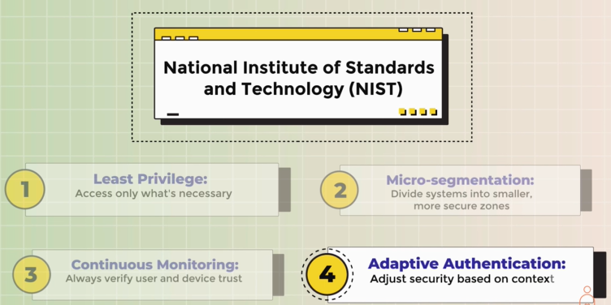
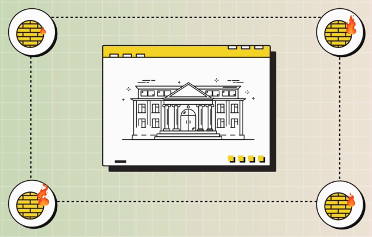

# Zero Trust Security (ZTS) 
## Overview
- https://www.youtube.com/watch?v=KBxkdPhKOHc
-  critical cybersecurity approach, especially with the increasing adoption of cloud environments.
- Core Principle: 
  - "Never Trust, Always Verify"
  - Requires authentication, authorization, and encryption for all access requests
  - Protects against insider threats as well.

## ZTS Model
- micro-segmentation : Network is segmented into smaller, isolated networks
- least privilege
- Continuous Verification
- Adaptive Authentication
  - Security adjustments based on context (e.g., location, user behavior)

## Traditional Perimeter-Based Security
- Relied on a strong perimeter (e.g., firewalls) 
- Assumed everything inside the perimeter was trusted
- Ineffective in multi-cloud and hybrid environments

