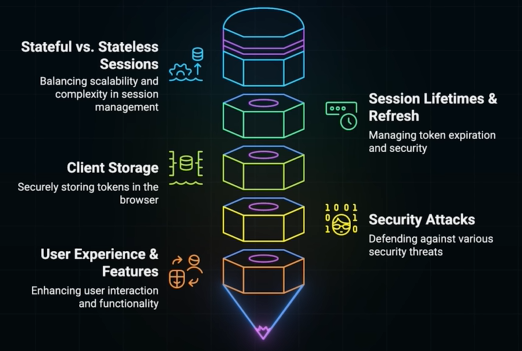
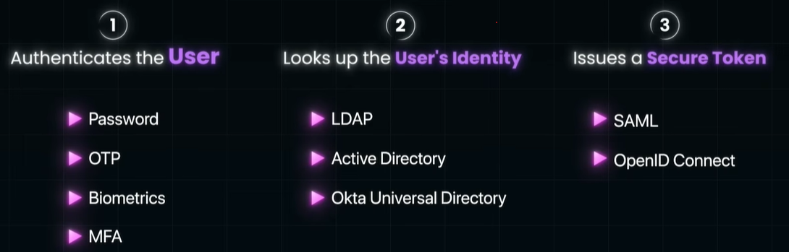
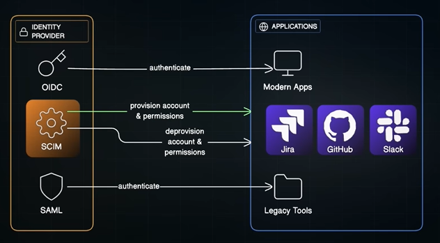

# IAM
## Overview
- https://www.youtube.com/watch?v=esw0GzYWUyw&ab_channel=ByteMonk
- 2 things of IAM framework:
  - **identity** -- who (login), handles by idp.
  - **Access mgt**  -- what can access (roles / polices)
- AWS iam is not enough for org, since it handle only AWS resource. But there are lots od other SP org uses.
- Hence, needs a full framework for IAM.
  - **Okta** provides all service for IAM
  - legacy support
  - modern support
  - seamless integration

- **Authn**
    - ✔️login by idp,
    - ✔️login by idp once for multiple SP === SSO
    - 🧾token : identity token
    - ➿protocols: OIDC, SAML
- **Authz**
    - ✔️Access Mgt, delegate Authorization, boundaries
    - 🧾token: access token
    - ➿protocols: OAuth

- **Build custom IAM system** 
  - not recommended
  - use managed tool like Auth, okta, AWS Cognito
  - openSource - `keyCloak`, `superToken`
  - key below things in mind while building

---
## IAM Architecture (in org)
- **Flow**
    - Provision user identities from HR and SCIM into Identity Repository.
    - **Identity Provider** authenticates users based on repository data.
        - Authentication using MFA, password, or biometrics , then return oidc identity token
        - Authorization RBAC/ABAC policies + Oauth2 accessToken
        - Federation enables SSO to external applications / service providers.
      
### A. pre-work  
**User Provisioning System**

- HR System: Manages personnel identity data:
  - onboarding/offboarding system ✔️
  - with SCIM standards

**Identity Repository** (Stores user identity data)

- LDAP ✔️
- Active Directory (AD)
- Azure Active Directory (Azure AD)
- Okta Universal Directory 👈🏻

---
### B. Identity, part (Who)
#### 1. Identity Provider (IdP)

- scenario: login github with google > google confirm identity > github trust
- idp is system which makes it work
  - verifies credential
  - issues secure token
  - hands off token to app/service
- provider:
    - Okta  ✔️
    - Auth0
    - Azure AD
    - Google
- Authentication, by looking into Identity Repository:
  - Passwords  ✔️
  - Multi-Factor Authentication (MFA) ✔️
  - OTP
  - Biometrics
  - Passwordless methods
- Issues authentication tokens:
  - ➖SAML
  - ➖OpenID connect  OAuth
- IDP also follows **SCIM**
  - plumbing pipeline for
  - provision and de-provision user/role/etc inside Idp
  - Standards for automated identity provisioning into identity repositories
  - 

#### 2. Federation / Single Sign-On (SSO)
- SSO is simple concept, what lots of engineering and protocol to nake it work.
- **Service Providers** --> Applications or systems, users access via federation
  - GitHub, Salesforce  harness, venafi, hcp, aws, etc
- federation help with:
  - to authenticate **once** with idp
  - get access to multiple app ( **service-providers** ) without login again.
    - passes auth token (saml, openID connect)
    - basically there is **trust relationship** between app abd idp
  - Again this is complex flow, and driven by protocols like:
    - [protocol_saml](03_protocol_saml.md) oldest
    - [protocol_oidc.md](03_protocol_oidc.md)
- thus this enables SSO.
  - one set of credential
  - consistent security policies
  - Single place to enforce MFA, session timeout,, etc
- Note: Idp can also share access token
- ccgg: 👈🏻
  - idp/okta shares `identity-token` only
  - login as aws federated use and assume role
  - then aws iam, for access mgt of aws resources. 
  - so, not idp provided `access-token`

---
### C. Access management, part
- Determine user permissions and boundaries.
- components:
  - Role
  - group
  - Attributes
- **common authZ Model**:
  - Role-Based Access Control (RBAC) ✔️
  - Attribute-Based Access Control (ABAC)
  - Decision engines eg: OPA
- IAM sits inside:
  - Application-level,  java SB `@hasRole`
  - Platform-level:
    - aws -->  iam-role,iam-policies for aws resources only
    - okta --> all SaaS, across app resources
