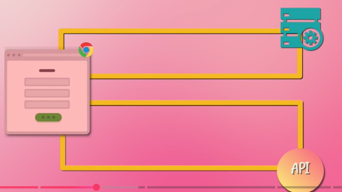
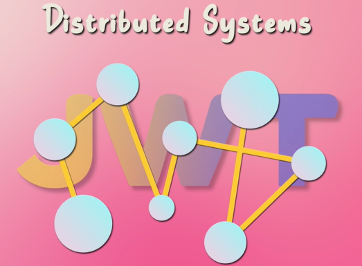

# Jwt
## Overview
- [JWT](https://chatgpt.com/c/6866e4b3-d6d8-800d-a053-ad736cec9b28)
- https://www.youtube.com/watch?v=iB__rLXGsas&list=PLJq-63ZRPdBt-RFGwsJO9Pv6A8ZwYHua9 bm
- old - Session-token.
  - eg: Jsession ID in JSP app. stored by server.
- **Core feature:**
  - self-contained - Stateless (no session storage required)
  - Easily verified by resource server
  - URL-safe
  - compact  / light weight
    - easily and securely send over internet.  
    - performance is improved, 
    - efficient for ms comm.
  - flexible and adaptable, since use to represent **variety of claims**
  - fixes Scalability issues : since session info is not stored on backend server, no need to scale it.
- **signing JWT**
  - private key to sign
  - public key to verify jwt
- 
---
## use case


- reducers the load on Authn service 
- same token can be access multiple ms


---
## JWT Structure
- <Header>.<Payload>.<Signature>

**header (Base64Url encoded JSON)**

```json
{
  "alg": "HS256", // algo to sign the token
  "typ": "JWT" // always JWT
}
```

```python
json_string = '{"alg":"HS256","typ":"JWT"}'
import base64
base64url_header = base64.urlsafe_b64encode(json_string.encode()).rstrip(b'=').decode()
# eyJhbGciOiJIUzI1NiIsInR5cCI6IkpXVCJ9
```


**payload (Base64Url encoded JSON)**
- never store sensitive info in payload.
- Contains the **claims** (user data, metadata).
- type:
  - **registered**
    ```json
    {
    
    "iss": "https://<your-okta-domain>.okta.com/oauth2/default",
    "sub": subject (user ID),
    "aud": audience,
    "exp": expiration time,
    "iat": issued at,
    "scp": []
    }
    ```
  - **Custom** :  Store any kind of info want to keep in token.
    ```json
    {
    "role": "",
    "scp": []
    }
    ```
    
**Signature** / wax seal
- Ensures Authenticity of token.
- Used to verify that the token is not tampered with
- The **secret** is a shared secret key known only to the issuer 
- verifier  use public key
- It must be kept private, AWS Secrets Manager
- created from below 3 things:
```
HMACSHA256(
  base64UrlEncode(header) + "." + base64UrlEncode(payload),
  secret 👈🏻
)
```

## JWT verifier - manual (py sample)
- Note: SB project Automatically calls JWKS endpoint dynamically fetch and verify the JWT's signature.

```python
from jose import jwt
import requests

# Fetch JWKS from Okta
jwks_url = "https://<your-okta-domain>/oauth2/default/v1/keys"
jwks = requests.get(jwks_url).json()

# Extract token from request (e.g., Authorization header)
token = "<access_token_here>"

# Decode token header to find 'kid'
unverified_header = jwt.get_unverified_header(token)
kid = unverified_header['kid']

# Find matching public key
key = None
for jwk in jwks['keys']:
    if jwk['kid'] == kid:
        key = jwk
        break

# Decode and verify token using public key
from jose import jwk as jose_jwk
from jose.utils import base64url_decode

public_key = jose_jwk.construct(key)
message, encoded_sig = token.rsplit('.', 1)
decoded_sig = base64url_decode(encoded_sig.encode())

if public_key.verify(message.encode(), decoded_sig):
    payload = jwt.decode(token, public_key, algorithms=['RS256'], audience="api://default")
    print("Verified payload:", payload)

```