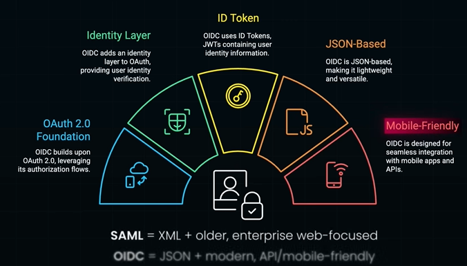

# OIDC
## Overview
```
SP (sp1, sp2, sp3, ...) <-- SSO ( using some protocol ) --> IDP
```
- SSO concepts.
- oidc is one of the **newest** protocol for SSO.
  - For modern system
  - Json-based, light-weight
  - primarily for MobilApps and microServices/APIs
- other **older** protocol for SSo : `SAML, WS-F`
- oidc built as additional layer ontop for existing OAuth2.0 to handle Authn scenarios including SSO


