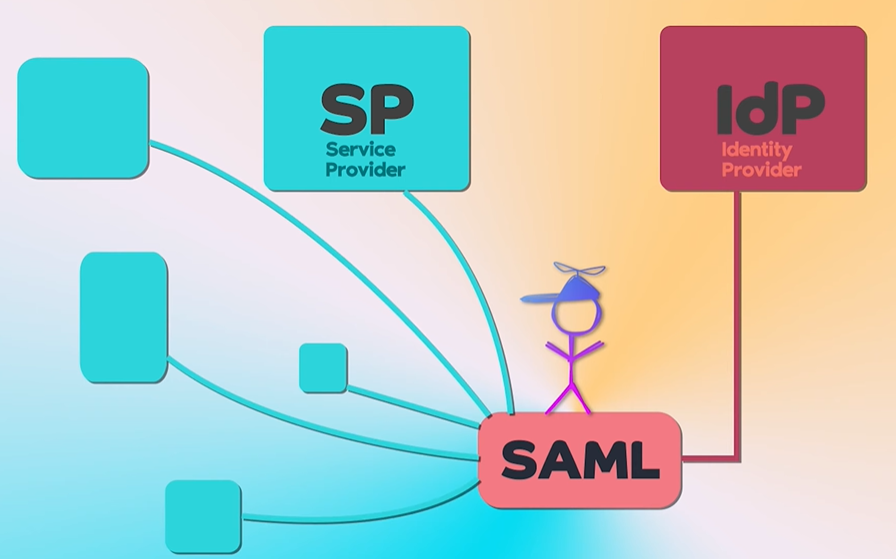
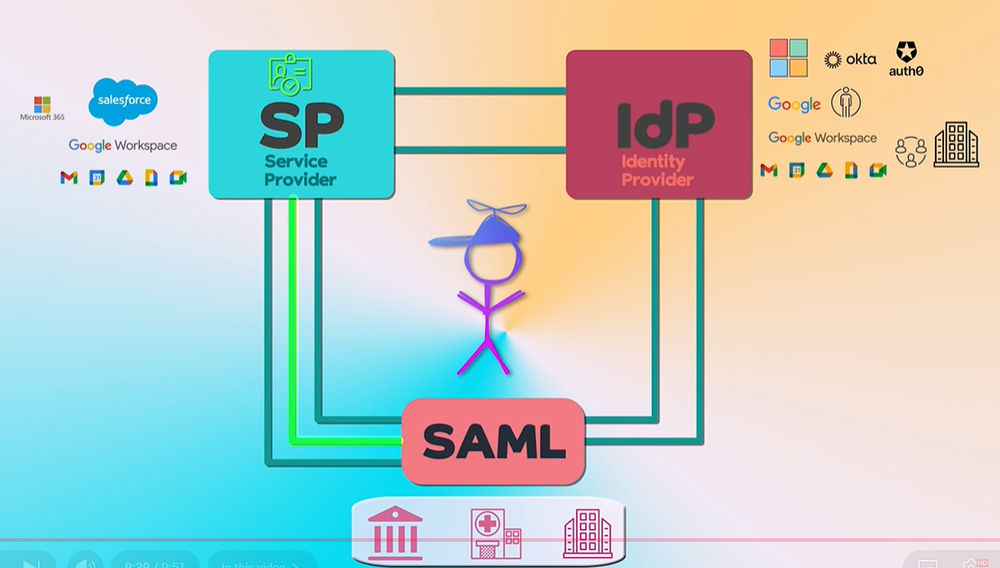
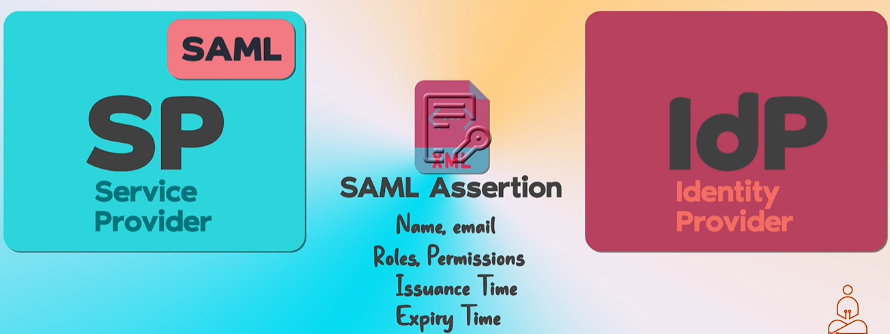

# SAML
## Overview 
```
SP (sp1, sp2, sp3, ...) <-- SSO ( using some protocol ) --> IDP
---
SAML enabled SP (sp1, sp2, sp3, ...) <-- SSO ( protocol SAML )--> IDP
SP <-- exchanges XML Assertion doc --> IDP
```
- https://www.youtube.com/watch?v=4ULlJEupV-I&list=PLJq-63ZRPdBt-RFGwsJO9Pv6A8ZwYHua9 bm
- SAML (Security Assertion Markup Language), XML based.
- It allows:
  - IDP authenticate user once 
  - and pass their identity to **ServerProvider** in our org ( Saas, AWS, harness, github etc)
- **Okta tool**
  - also simplifies SAML setup via pre-built integrations with many SPs.
  - enhance security and enterprise IT experience
  




---
## SAML Assertion

- note: in oidc we have token, xml is equivalent of token. 👈🏻
- XML doc + signed by IDP (ensures no tempering, like jwt signature)
- Defines how SSO/Authn-info will be share between parties (without imposing sensitive info):
  - **saml enabled SP**
  - IDP


## use cases
- authn/browser-based-sso use-case in an organization

## Comparison with other protocol
- **saml vs oidc**
    - saml
        - specialized for authn/browser-based-sso use-case in an organization.
        - use XML assertion
        - identity federation use case
    - oidc
        - specialized for authn/sso
        - uses json, jwt
        - identity federation use case
        - has delegated authz feature (OAuth2 layer).
            - adopted for ms2ms comm use case