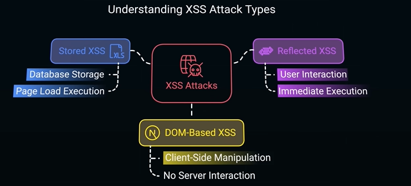

# Cross-Site Scripting (XSS)
## Overview
- https://www.youtube.com/watch?v=m-0p2BFAZvI
- web vulnerability that allows attackers to **inject malicious scripts into websites**.
- usually comes from server response.
- inject malicious content directly into DOM.
- eg:
  - script to steal cookies 
    - `<script>document.cookie</script>` 
    - which can have access-token
    - one click from suspicious email, and session is hijacked
    - payPal incident.
  - script to redirect
  - script to log keyStroke (password)
  - `<script>alert("hacked")</script>`



---
## Fix
- Sanitize input using security-lib (`DomPurify`)
```js
import DOMPurify from 'dompurify';
safeHtml = DOMPurify.sanitize(htmlFromApi);
```
- Escape html charactor
- block inline script
- js - `innerHTML` >> replace with `textContent`
- Content Security Policy (CSP)
    ```
    Content-Security-Policy:
      default-src 'self';
      script-src 'self';
      object-src 'none';
    ```
### FIX : NG
- ng is secured from XSS (Dom based)
  - Automatic HTML escaping
  - Context-aware sanitization
  - Angular does not use innerHTML by default.
- does not protect from backend-rendered HTML
  - Validate + encode server responses
- Use {{ }} interpolation always
- Never bind user input to event attributes
