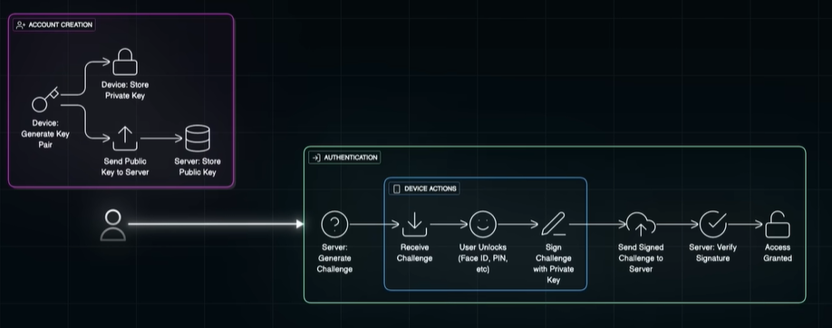
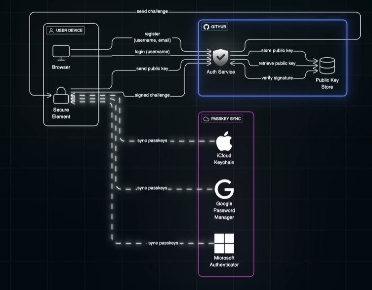

# passKeys
## Overview
- as of 2026 jan, still in early phase. 
- adoption in progress...
- https://www.youtube.com/watch?v=6Dq4Z8Nk1z8&list=PLJq-63ZRPdBt-RFGwsJO9Pv6A8ZwYHua9&index=22

## Question
- what if lost the device or device malfunctioned, passkey lost ?
- Cross compatibility
  - windows passkey should work on apple ?
  - or need to separate create key for all device ?
  - need mass adoption