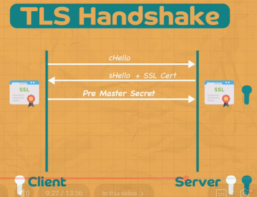
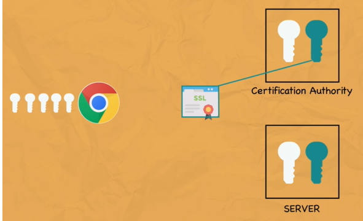
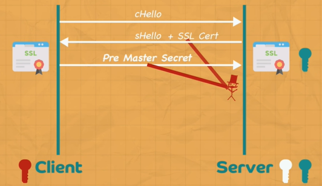
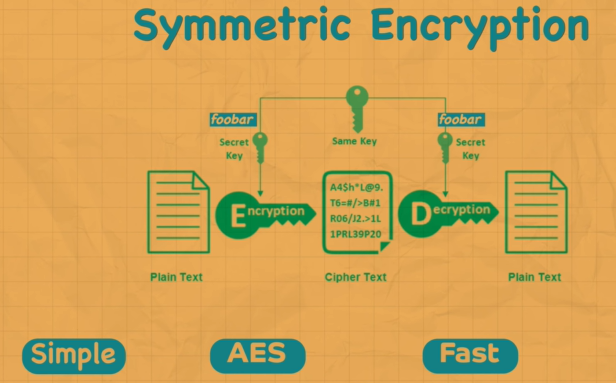
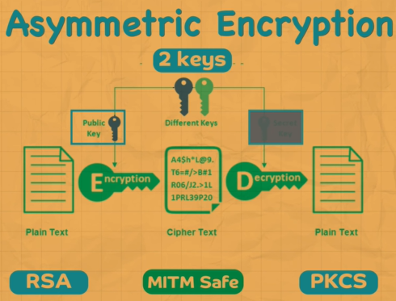

# https
## Overview
- **man in the middle** Attack with `http`
- TLS / transport layer security (level=4) 
  - https (level=7)
- Its **TLS handshake**, which make connection secure, bts.
- All communication is encrypted 
- One brutal truth : 
    > Certificates authenticate identity.
    > They do NOT encrypt application data.
- **Think of mTLS** as 
  - TLS + “UNO reverse card” for authentication 😄
  
    | Aspect                         | TLS (one-way)         | mTLS (two-way)                           |
    | ------------------------------ | --------------------- | ---------------------------------------- |
    | Server authenticates to client | ✅                     | ✅                                        |
    | Client authenticates to server | ❌                     | ✅                                        |
    | Certificates used by           | Server only           | **Server + Client**                      |
    | Use cases                      | Browsers, public APIs | Microservices, internal APIs, zero-trust |




- **TLS/SSL certificate**

[01_04_x.509.md](01_04_x.509.md)

```
A TLS certificate contains:
    Server public key
    Server identity (domain: abc.com)
    Validity period
    Issuer (CA)
    Digital signature by CA’s private key

- CA only signs the certificate after verification
    - sign with ca-private-key
```
- 3rd party CA;s public kay is already present in chrome and other browser 👈🏻👈🏻



---
## Scenarios for understanding
### Flow-1 (No certificate)
```
✔️Flow:
Server creates RSA key pair
Server shares "public-key" 👈🏻
symetric key (fast):
    cleint create preMasterSecret
    encrypt with public key
    server decrypts and get it.
Client encrypts data with symetric key
Server decrypts with symetric key

✔️Fatal flaw:
How does the client know the "public-key" actually belongs to the server?

That’s the classic Man-in-the-Middle (MITM) problem.
An attacker can replace the public key and transparently decrypt/re-encrypt traffic.

👉 Conclusion:
Encryption without authentication is useless on the internet.

This is exactly why TLS + certificates exist.
```



### Flow-2 (Modern TLS 1.3 flow)
```
1️⃣ Certificate issuance (offline)
- Server generates key pair
- Sends CSR to CA
- CA verifies domain ownership
- CA signs certificate with CA private key
- Server installs cert + private key
```
```
2️⃣ Client connects to https://abc.com
Handshake begins (Authentication):
    1. Server sends certificate
        Includes server public key
        Includes CA signature
    2. Client verifies certificate
        Uses CA public key (already in OS/browser trust store) 👈🏻
        Verifies:
            Signature valid
            Domain matches abc.com
            Not expired / revoked

    ✅ If this passes → server identity is trusted
```

```
3️⃣ Key exchange (ECDHE – mandatory in TLS 1.3)

- Client sends ephemeral public key (ClientHello)
- Server sends ephemeral public key (ServerHello)
- Server signs handshake using its private key
- Client verifies signature using cert public key
- Both sides derive the SAME shared secret

All application data encrypted with symmetric session keys (fast)
```

---
## Encryption


