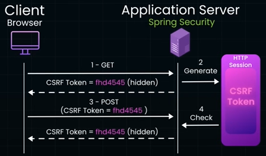

# CSRF
## Overview
- https://www.youtube.com/watch?v=2cUQWhSrOK0
- trick user's browsers to unknowingly make malicious unintended request 
- by taking adv of **already Authenticated session**
- eg:
  - unknow transaction in bank website
  - make unknown post in social media sites. twitter incident
  - 2012, github incident, attacker making change email, then resetting password.
- security tools detect vulnerabilities:
  - OWASP ZAP, Burp Suite, and CSRF Tester 
  

---
## Fix
### Csrf token

- Every state-changing request must include a server-generated token.

Rules that matter:

- Token is random, unguessable
- Token is tied to the user session
- Token is validated on every POST/PUT/PATCH/DELETE

Where to put it:

- HTML forms → hidden input
- custom header (e.g. X-CSRF-Token)

Spring Security → CSRF protection ON by default (don’t disable it blindly)

### SameSite cookies

- `SameSite=Strict`
- This attribute prevents cookies from being sent in cross-site requests,
- automatically blocking many CSRF attacks.
