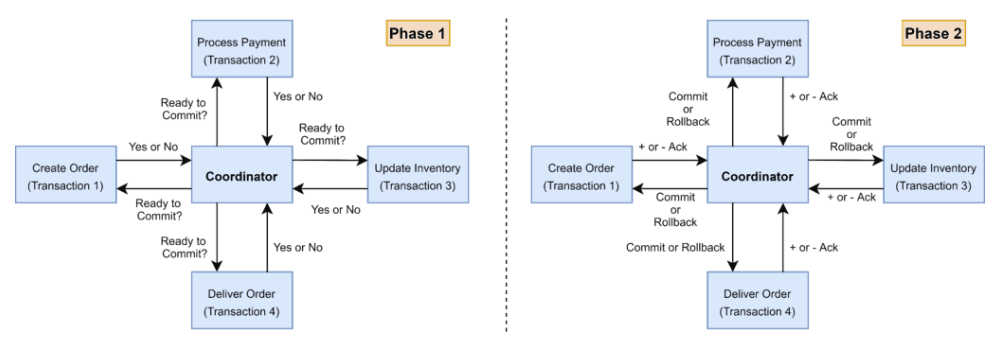
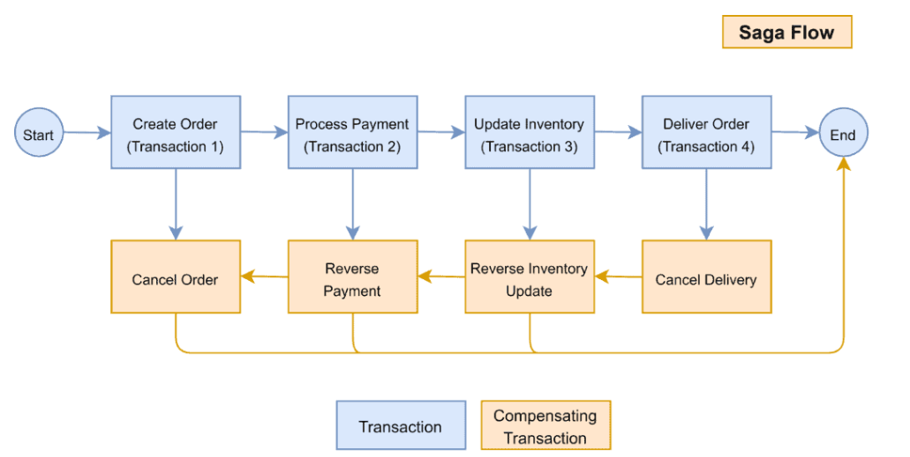
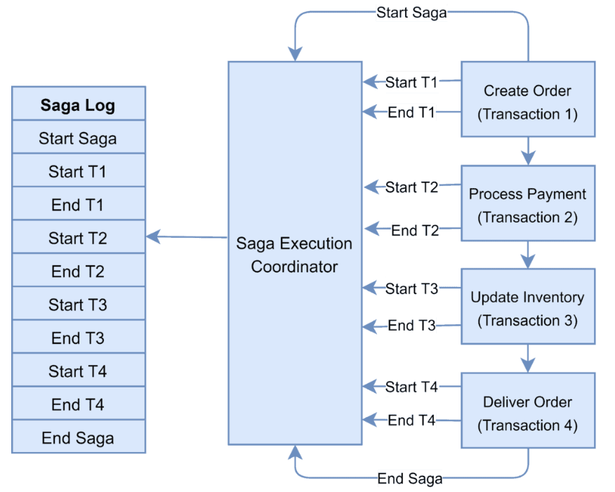
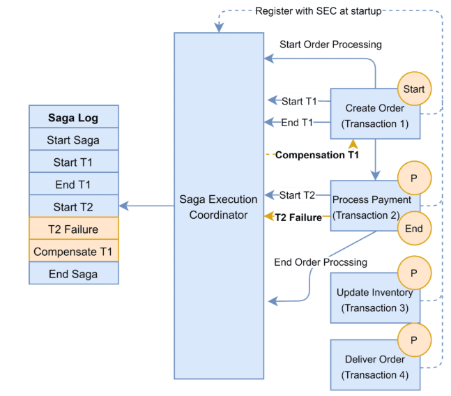
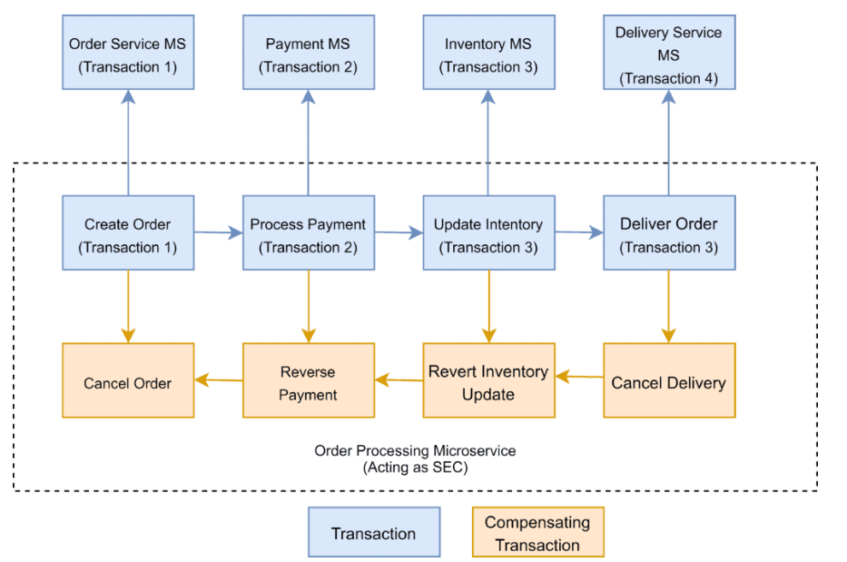

# Distributed Transaction
## Overview
- transaction spans several services/ms
- participant performs local transactions
- https://www.baeldung.com/cs/saga-pattern-microservices
- ACID
  - **Atomicity**
  - **Consistency** takes data from one valid state to another valid state.
  - **Isolation** guarantees that concurrent transactions should produce the same result that sequentially transactions would have produced
  - **Durability**: Remain committed irrespective of any type of system failure
- isolation level  
  - the amount of data that is visible in a transaction 
  - when the other services access the same data simultaneously.
  
## solution-1 : 2PC 
- phases : prepare > commit
- there is a **coordinator component**, contains the logic to manage the transaction.
- 
- cons:
  - coordinator node, can become the single point of failure.
  - All other services need to wait until the slowest service finishes
  - not supported in NoSQL databases.
    - ms1 (sql) , ms(noSQL) ❌

## Solution-2 : SAGA
- saga flow:
  - **Saga participant**
  - **Saga Execution Coordinator** / SEC
    - captures saga-logs (sequence of events of a distributed transaction)
    - inspects the Saga log to identify the impacted components 
    - and the sequence in which the compensating transactions should run.
    - compensating transactions must be idempotent and retryable. 👈🏻

### choreography 
- each microservice that is part of the transaction publishes an event that is processed by the **next microservice**.
- good few participants
- `Axon Saga` – a lightweight framework and widely used with Spring Boot-based microservices

### orchestration
- a **single** orchestrator is responsible for managing the overall transaction status

